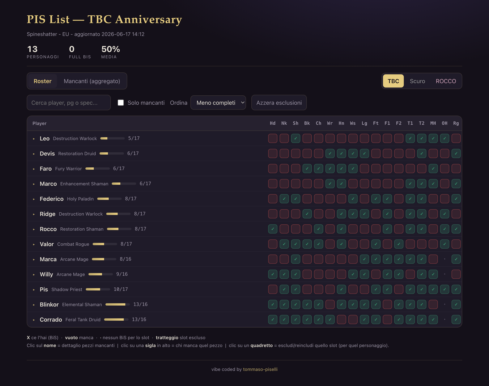

# Pis List

A small **best-in-slot (BiS) roster tracker** for a *World of Warcraft: The Burning Crusade
(TBC) Anniversary* guild. It compares each character's **currently equipped gear** (from the
official Blizzard API) against their **BiS list** (scraped from [wowtbc.gg](https://wowtbc.gg)),
then renders an interactive, slot-by-slot matrix showing who is still missing what.



## How it works

```
characters.csv  ──►  bis_diff.py  ──►  bis_data.js  ──►  roster.html
                     (Blizzard API
                      + wowtbc.gg)
```

- **`bis_diff.py`** — reads the character list, logs into the Blizzard API, scrapes BiS lists,
  diffs equipped vs. BiS slot by slot, and writes `bis_data.js`.
- **`roster.html`** — a standalone page (no build step, no server required) that loads
  `bis_data.js` and `tiers.js` and renders the roster. Just open it in a browser.
- **`tiers.js`** — optional config that groups class tier-set tokens so shared set pieces are
  aggregated into a single entry.

### Using the page

- **TBC / Scuro / ROCCO** — three color themes (top right).
- **Roster / Mancanti (aggregato)** — per-character matrix, or an aggregated "who needs what" view.
- Click a **name** for the list of that character's missing pieces.
- Click a **column header** (slot) to see everyone missing that piece.
- Click a **cell** to exclude / re-include that slot for a character (saved in your browser).

> The UI is in Italian.

## Setup — adding the missing files

For privacy, the data files are **not** committed to the repo (see `.gitignore`). After cloning
you need to provide two of them; `bis_data.js` is then generated for you.

### 1. Install dependencies

```bash
pip install requests beautifulsoup4
```

### 2. Blizzard API credentials → `blizzard_api.json`

1. Go to <https://develop.battle.net/access/clients> and log in with your Battle.net account.
2. Click **Create Client**, give it any name (e.g. `bisdiff`), leave the rest empty.
3. Copy the **Client ID** and **Client Secret**.

On first run the script prompts for these and offers to save them to `blizzard_api.json`. You can
also create the file manually:

```json
{ "client_id": "YOUR_CLIENT_ID", "client_secret": "YOUR_CLIENT_SECRET" }
```

Alternatively, set the environment variables `BLIZZARD_CLIENT_ID` and `BLIZZARD_CLIENT_SECRET`.

### 3. Character list → `characters.csv`

A header-less CSV, one character per line:

```
pg_name, player_name, Class Spec[, realm[, region]]
```

`realm` and `region` are optional (defaults: realm `Spineshatter`, region `eu`). Example:

```
Pispispis, Pis, Shadow Priest
Gìnevra, Federico, Holy Paladin
Saracinesku, Faro, Fury Warrior, Spineshatter, eu
```

### 4. Generate the data and open the page

```bash
python3 bis_diff.py
```

Choose option **`2`** (`piu' da CSV`) and point it at `characters.csv`. It writes `bis_data.js`.
Then open **`roster.html`** in your browser.

> Until `bis_data.js` exists, `roster.html` shows a "Nessun dato trovato — run `bis_diff.py`"
> empty state.

## License

[MIT](LICENSE)

---

vibe coded by [tommaso-piselli](https://github.com/tommaso-piselli)
